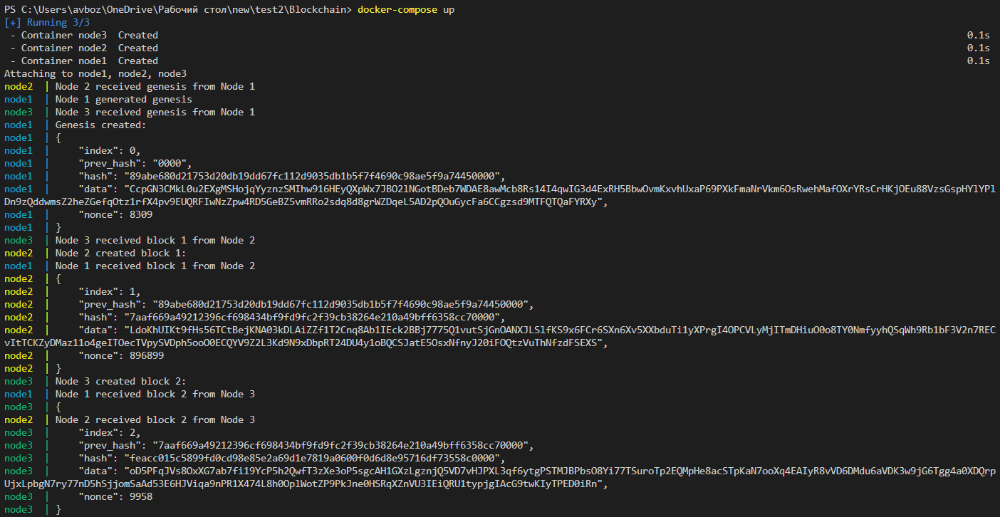
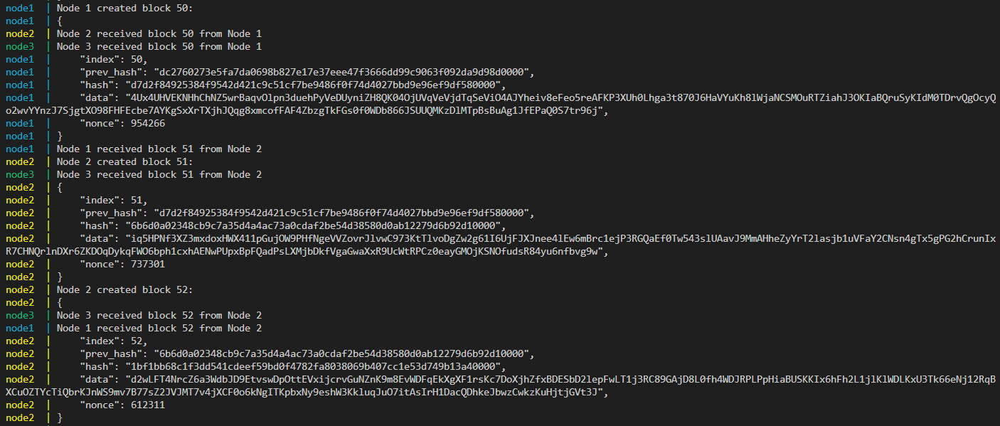

develop:  

main: 

# Blockchain
Блокчейн на языке Python с использованием сокетов.

Каждый блок состоит из следующих полей:
- index - номер блока. Номера возрастают по порядку с первого.
- prev_hash - хеш предыдущего блока.
- hash - хеш текущего блока (его нужно вычислить).
- data - данные (строка длинной случайных 256 символов).
- nonce - это дополнение, которое нужно сделать в блоке таким, чтобы выполнялось требование по хешированию.

Для производства блока нужно сконкатенировать поля index, prev_hash, data и nonce. 
Для полученной строки вычисляется хэш с помощью хеш-функции предлагаю использовать sha256. 
Результат записывается в поле hash, но только при условии, что он заканчивается на 4 ноля. Если это не так, то нужно изменить (nonce) дополнение и снова попробовать вычислить хеш.

Как только новый блок сгенерирован, нужно отправить его остальным узлам сети и переходить 
к генерации следующего блока. В то же время, пока узел подбирает хеш, кто-то из соседних 
узлов мог добиться успеха раньше - в этом случае сгенерированный блок приходит к данному 
узлу, и он переходит к генерации нового блока, используя полученный блок в качестве 
предыдущего.

# Запуск программы
1. Клонировать репозиторий
``` console
git clone https://github.com/BozhkoAV/Blockchain.git
```

2. Перейти в папку проекта
``` console
cd Blockchain
```

3. Собрать Docker образ
``` console
docker build -t blockchain .
```

4. Запустить Docker Compose
``` console
docker-compose up
```

# Демонстрация работы

- создание генезиса и первых блоков



- создание блоков 50-52


